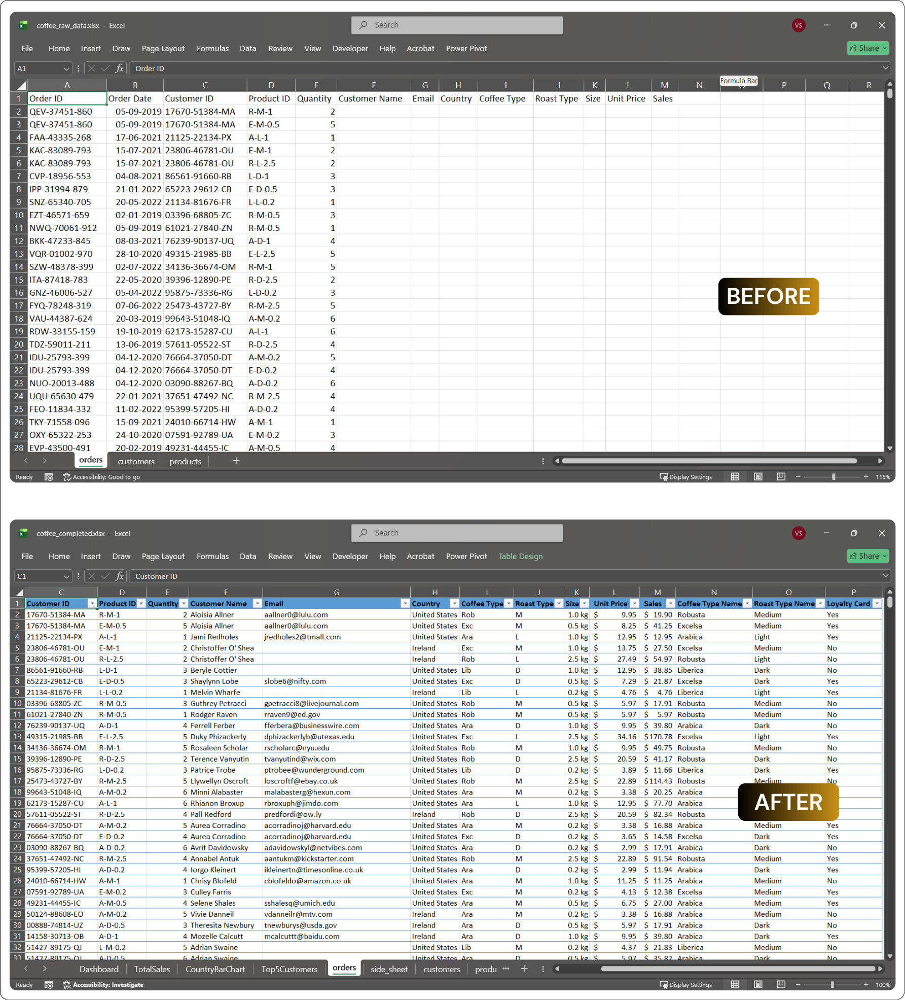

# Advanced Data Cleaning & Transformation in Microsoft Excel

##  Project Overview

This project demonstrates how messy and inconsistent datasets can be transformed into a clean, structured, and analysis-ready dataset using modern Microsoft Excel functions.

The project focuses on solving common real-world data quality issues such as duplicate records, inconsistent values, embedded dates and times, irregular formatting, and unstructured text. Advanced Excel functions were used to automate the cleaning process and prepare the data for reporting and further analysis.

---

#  Business Objective

The objective of this project is to transform raw and inconsistent data into a standardized dataset by:

- Cleaning inconsistent records
- Standardizing values and formatting
- Extracting structured information from text
- Combining and reshaping datasets
- Validating the cleaned output
- Preparing the dataset for reporting and analysis

---

#  Tools & Functions Used

### Microsoft Excel

### Dynamic Array Functions

- WRAPROWS
- TAKE
- VSTACK
- CHOOSECOLS

### Lookup Functions

- XLOOKUP

### Text Functions

- TRIM
- TEXTAFTER
- SUBSTITUTE
- REGEXEXTRACT

### Logical Functions

- LET
- IF
- IFERROR

---

#  Folder Structure

```
advanced_data_cleaning

│
├── 01_dataset
├── 02_excel_files
├── 03_assets
└── README.md
```

---

#  Project Workflow

The project follows a structured data preparation workflow:

1. Raw Dataset
2. Data Preparation
   - Data Cleaning
   - Data Transformation
   - Data Formatting
3. Data Validation
4. Analysis-Ready Dataset


---

#  Data Cleaning Process

The following data preparation techniques were applied throughout the project:

### Data Cleaning

- Removed duplicate records
- Standardized inconsistent values
- Cleaned text fields
- Removed unnecessary spaces

### Data Transformation

- Combined datasets
- Reshaped data using Dynamic Arrays
- Extracted dates from descriptive text
- Extracted event times from text
- Converted text into proper Excel dates
- Standardized lookup values

### Data Formatting

- Converted data into Excel Tables
- Applied currency formatting
- Standardized date formatting
- Improved overall readability

### Data Validation

- Verified extracted values
- Checked data consistency
- Handled missing values using conditional logic
- Ensured the dataset was analysis-ready

---

#  Advanced Excel Functions Used

| Function | Purpose |
|----------|---------|
| WRAPROWS | Converted a single column into structured rows |
| TAKE | Selected the required columns from reshaped data |
| VSTACK | Combined multiple datasets into a single table |
| CHOOSECOLS | Selected only the required columns |
| TRIM | Removed unnecessary spaces |
| XLOOKUP | Standardized lookup values |
| LET | Improved readability of complex formulas |
| IF | Applied conditional logic |
| IFERROR | Handled invalid or missing values |
| TEXTAFTER | Extracted dates from descriptive text |
| SUBSTITUTE | Standardized inconsistent date formats |
| DATEVALUE | Converted text into valid Excel dates |
| REGEXEXTRACT | Extracted event times using regular expressions |

---

#  Before vs After

The comparison below highlights the transformation from raw, inconsistent data into a clean, structured, and analysis-ready dataset.



---

#  Skills Demonstrated

- Data Cleaning
- Data Transformation
- Data Formatting
- Dynamic Arrays
- Lookup Functions
- Text Manipulation
- Date & Time Extraction
- Error Handling
- Dataset Standardization
- Excel Tables
- Data Validation
- Advanced Excel Functions

---

#  Project Contents

- Raw Dataset
- Cleaned Dataset
- Excel Workbook
- Project Assets
- README Documentation

---

# 🚀 Learning Outcome

This project demonstrates practical techniques for cleaning, transforming, and validating messy datasets using modern Microsoft Excel functions. By combining dynamic arrays, lookup functions, text manipulation, and logical functions, the workflow automates repetitive data preparation tasks and produces a reliable, analysis-ready dataset suitable for reporting and business analysis.
