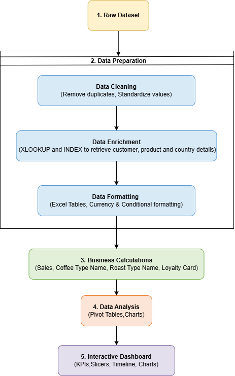
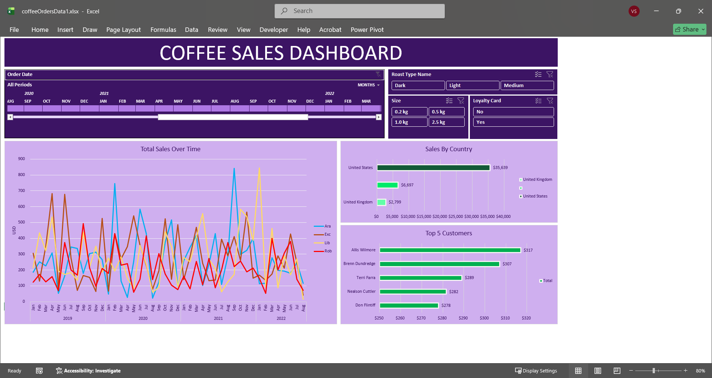

#  Interactive Coffee Sales Dashboard in Microsoft Excel

##  Project Overview

This project demonstrates the complete process of transforming raw coffee sales data into an interactive Excel dashboard. The project involves enriching transactional data using lookup functions, creating calculated fields, building pivot tables, and designing a dynamic dashboard for business reporting.

The dashboard enables users to analyze coffee sales performance by product, customer, country, roast type, loyalty status, and time period.

---

#  Business Objective

The objective of this project is to build an interactive reporting solution that helps answer business questions such as:

- Which coffee types generate the highest sales?
- Which countries contribute the most revenue?
- Who are the top-performing customers?
- How do sales change over time?
- Does customer loyalty influence sales performance?

---

#  Tools Used

- Microsoft Excel
- XLOOKUP
- INDEX + MATCH
- Pivot Tables
- Pivot Charts
- Slicers
- Timeline
- Dashboard Design

---

#  Folder Structure

```
Interactive_coffee_sales_dashboard

│
├── 01_dataset
├── 02_excel_files
├── 03_assets
└── README.md
```

---

#  Project Workflow

The project follows a structured analytics workflow:

- Raw Dataset
- Data Preparation
  - Data Cleaning
  - Data Enrichment
  - Data Formatting
- Business Logic
- Data Analysis
- Interactive Dashboard



---

#  Data Preparation

The raw sales dataset was enriched and transformed before analysis.

### Customer Data Enrichment

Using **XLOOKUP**, the following customer information was retrieved:

- Customer Name
- Email
- Country
- Loyalty Card Status

### Product Data Enrichment

Using **INDEX + MATCH**, product information was retrieved:

- Coffee Type
- Roast Type
- Size
- Unit Price

### Additional Transformations

- Converted coffee abbreviations into full coffee names.
- Converted roast abbreviations into readable roast levels.
- Calculated Sales using Quantity × Unit Price.
- Applied currency formatting.
- Applied date formatting.
- Converted the dataset into an Excel Table.

---

#  Dashboard Features

The interactive dashboard includes:

- Total Sales KPI
- Monthly Sales Trend
- Sales by Country
- Top 5 Customers

Interactive filters include:

- Timeline
- Roast Type
- Package Size
- Loyalty Card Status

---

#  Dashboard Preview



---

#  Skills Demonstrated

- Data Cleaning
- Data Enrichment
- XLOOKUP
- INDEX + MATCH
- Calculated Columns
- Excel Tables
- Pivot Tables
- Pivot Charts
- Interactive Dashboard Design
- Business Analysis
- Data Visualization

---

# 🚀 Learning Outcome

This project demonstrates an end-to-end Excel analytics workflow, from preparing raw transactional data to delivering an interactive dashboard that supports business decision-making. It showcases practical Excel skills commonly used in data analysis and business intelligence projects.
