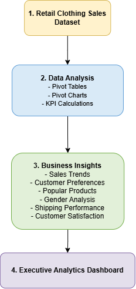
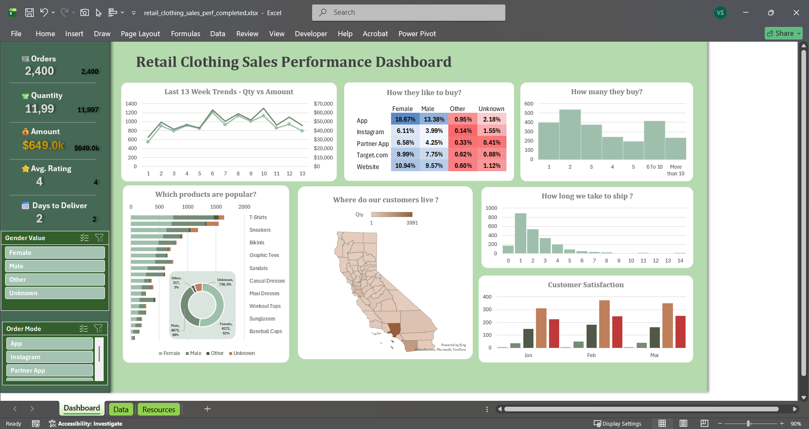

# Retail Clothing Sales Analytics Dashboard in Microsoft Excel

## Project Overview

This project demonstrates the development of an interactive Retail Clothing Sales Analytics Dashboard in Microsoft Excel using an existing retail clothing sales dataset. The project focuses on analyzing business performance through KPI reporting, Pivot Tables, Pivot Charts, and interactive dashboard design.

The dashboard answers key business questions by analyzing sales trends, customer preferences, product performance, shipping efficiency, and customer satisfaction to support data-driven business decisions.

> **Note:** The dataset was pre-cleaned. This project focuses on data analysis and dashboard development rather than data preparation.

---

# Business Objective

The objective of this project is to build an interactive reporting solution that helps answer business questions such as:

- What are the overall sales and profit performance metrics?
- Which products generate the highest sales?
- How do customer demographics influence purchasing behavior?
- Which shipping methods and delivery times perform best?
- How satisfied are customers with their purchases?
- How do sales vary across different regions?

---

# Tools Used

- Microsoft Excel
- Pivot Tables
- Pivot Charts
- KPI Reporting
- Slicers
- Dashboard Design

---

# Folder Structure

```
retail_clothes_sales_advanced_dash

│
├── 01_dataset
├── 02_excel_files
├── 03_assets
└── README.md
```

---

# Project Workflow

The project follows a structured business reporting workflow:

- Retail Clothing Sales Dataset
- Data Analysis
  - Pivot Tables
  - Pivot Charts
  - KPI Calculations
- Business Insights
  - Sales Trends
  - Customer Preferences
  - Popular Products
  - Gender Analysis
  - Shipping Performance
  - Customer Satisfaction
- Executive Analytics Dashboard



---

# Dashboard Features

The interactive dashboard includes:

### KPI Summary

- Total Sales
- Total Profit
- Profit Margin
- Average Order Value

### Sales & Product Analysis

- Monthly Sales Trends
- Top Selling Products
- Category Performance

### Customer Insights

- Customer Gender Analysis
- Customer Satisfaction
- Purchasing Preferences

### Operational Analysis

- Shipping Method Performance
- Delivery Time Analysis
- Regional Sales Distribution

### Interactive Filters

- Product Category
- Region
- Customer Gender

---

# Dashboard Preview



---

# Skills Demonstrated

- Business Performance Analysis
- KPI Reporting
- Pivot Tables
- Pivot Charts
- Interactive Dashboard Design
- Customer Analytics
- Trend Analysis
- Data Visualization
- Executive Reporting

---

# Learning Outcome

This project demonstrates how Microsoft Excel can be used to build advanced analytical dashboards that answer key business questions through interactive reporting. By combining KPI reporting, Pivot Tables, Pivot Charts, and dashboard design principles, the project delivers actionable insights into sales performance, customer behavior, and operational efficiency.
