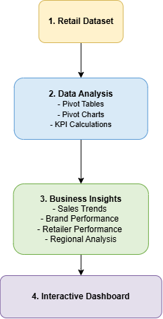
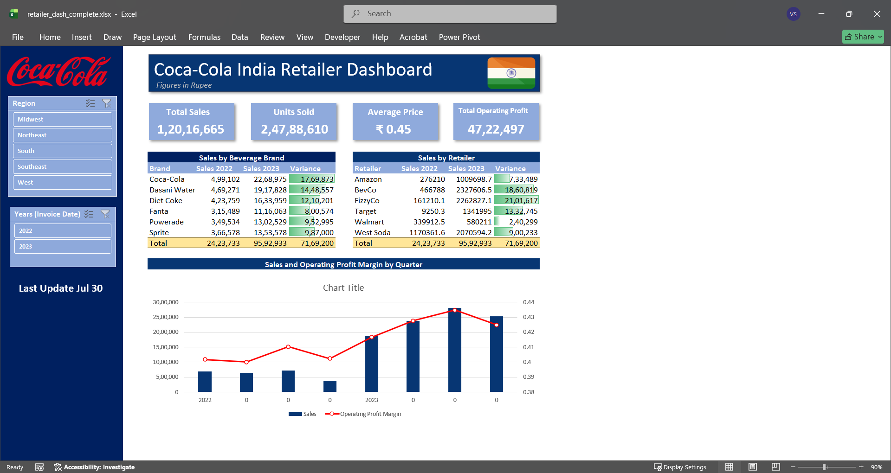

#  Retail Sales Performance Dashboard in Microsoft Excel

##  Project Overview

This project demonstrates the development of an interactive Retail Sales Performance Dashboard in Microsoft Excel using an existing retail sales dataset. The project focuses on analyzing business performance through Pivot Tables, Pivot Charts, KPI reporting, and interactive dashboard design.

The dashboard enables users to analyze sales performance across retailers, beverage brands, regions, states, and quarterly trends to support business reporting and decision-making.

> **Note:** The dataset was pre-cleaned. This project focuses on data analysis and dashboard development rather than data preparation.

---

#  Business Objective

The objective of this project is to build an interactive reporting solution that helps answer business questions such as:

- Which retailers generate the highest sales?
- How do beverage brands perform year over year?
- Which regions and states contribute the most revenue?
- How do sales and operating margins change throughout the year?
- What are the overall business KPIs?

---

#  Tools Used

- Microsoft Excel
- Pivot Tables
- Pivot Charts
- KPI Reporting
- Slicers
- Dashboard Design

---

#  Folder Structure

```
retail_sales_performance_dashboard

│
├── 01_dataset
├── 02_excel_files
├── 03_assets
└── README.md
```

---

#  Project Workflow

The project follows a structured business reporting workflow:

- Retail Dataset
- Data Analysis
  - Pivot Tables
  - Pivot Charts
  - KPI Calculations
- Business Insights
  - Sales Trends
  - Brand Performance
  - Retailer Performance
  - Regional Analysis
- Interactive Dashboard



---

#  Dashboard Features

The interactive dashboard includes:

### KPI Summary

- Total Sales
- Units Sold
- Average Price per Unit
- Operating Profit

### Sales Performance

- Beverage Brand Performance (2022 vs 2023)
- Retailer Sales Comparison
- Quarterly Sales Trends
- Operating Profit Margin

### Geographic Analysis

- Regional Sales Distribution
- State-wise Sales Performance

### Interactive Filters

- Region
- Beverage Brand
- Retailer

---

#  Dashboard Preview



---

#  Skills Demonstrated

- Business Performance Analysis
- KPI Reporting
- Pivot Tables
- Pivot Charts
- Interactive Dashboard Design
- Comparative Analysis
- Trend Analysis
- Data Visualization
- Executive Reporting

---

#  Learning Outcome

This project demonstrates how Microsoft Excel can be used to create interactive business reporting dashboards from existing datasets. By leveraging Pivot Tables, Pivot Charts, KPI reporting, and dashboard design principles, the project delivers actionable insights that support business performance monitoring and informed decision-making.
