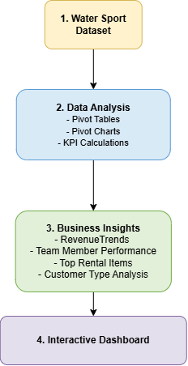
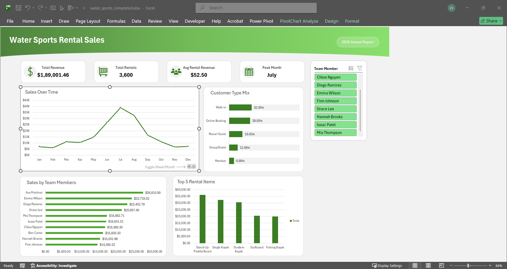

# Water Sports Rental Sales Dashboard in Microsoft Excel

## Project Overview

This project demonstrates the development of an interactive Water Sports Rental Sales Dashboard in Microsoft Excel using an existing rental sales dataset. The project focuses on analyzing business performance through Pivot Tables, Pivot Charts, KPI reporting, and interactive dashboard design.

The dashboard enables users to analyze rental revenue, team member performance, customer segments, top rental equipment, and sales trends to support business reporting and decision-making.

> **Note:** The dataset was pre-cleaned. This project focuses on data analysis and dashboard development rather than data preparation.

---

# Business Objective

The objective of this project is to build an interactive reporting solution that helps answer business questions such as:

- What is the overall rental revenue performance?
- Which team members generate the highest sales?
- Which rental items are the most popular?
- How do different customer types contribute to revenue?
- How do rental sales change over time?

---

# Tools Used

- Microsoft Excel
- Pivot Tables
- Pivot Charts
- KPI Reporting
- Slicers
- Dashboard Design

---

# Folder Structure

```
watersports_rental_sales_dashboard

│
├── 01_dataset
├── 02_excel_files
├── 03_assets
└── README.md
```

---

# Project Workflow

The project follows a structured business reporting workflow:

- Water Sports Dataset
- Data Analysis
  - Pivot Tables
  - Pivot Charts
  - KPI Calculations
- Business Insights
  - Revenue Trends
  - Team Member Performance
  - Top Rental Items
  - Customer Type Analysis
- Interactive Dashboard



---

# Dashboard Features

The interactive dashboard includes:

### KPI Summary

- Total Revenue
- Total Rentals
- Average Rental Value
- Top Performing Team Member

### Sales Performance

- Revenue Over Time
- Team Member Performance
- Top 5 Rental Items

### Customer Analysis

- Customer Type Distribution
- Revenue by Customer Type

### Interactive Filters

- Date
- Team Member
- Customer Type

---

# Dashboard Preview



---

# Skills Demonstrated

- Business Performance Analysis
- KPI Reporting
- Pivot Tables
- Pivot Charts
- Interactive Dashboard Design
- Trend Analysis
- Data Visualization
- Executive Reporting

---

# Learning Outcome

This project demonstrates how Microsoft Excel can be used to create interactive business reporting dashboards from existing datasets. By leveraging Pivot Tables, Pivot Charts, KPI reporting, and dashboard design principles, the project delivers actionable insights that support rental performance monitoring and informed business decision-making.
